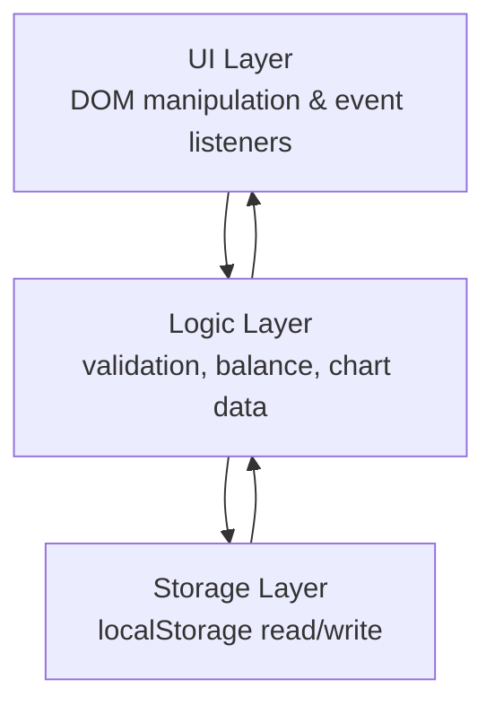
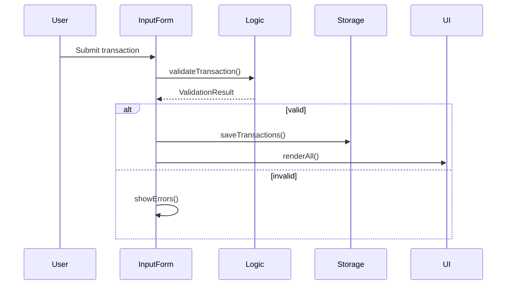

# Design Document: Expense & Budget Visualizer

## Overview

The Expense & Budget Visualizer is a single-page, client-side web application built with plain HTML, CSS, and Vanilla JavaScript. It requires no build step, no framework, and no backend. All state is persisted in the browser's `localStorage`. The app is deployed as a static folder (compatible with GitHub Pages) and is fully functional on mobile devices.

Core capabilities:
- Record transactions (name, amount, category)
- View a scrollable transaction history with sort controls
- See a live-updating total balance
- Visualize spending by category via a Chart.js pie chart
- Browse a monthly summary view
- Toggle dark/light mode (persisted)
- Manage default and custom categories (persisted)

## Architecture

The app is a single HTML file (`index.html`) with co-located CSS (`styles.css`) and JavaScript (`app.js`). There is no module bundler; ES modules or plain `<script>` tags are used.

```
expense-budget-visualizer/
├── index.html       # Shell, layout, and Chart.js CDN import
├── styles.css       # Responsive layout, theme variables (dark/light)
└── app.js           # All application logic
```

### Logical Layers (within app.js)



- **Storage Layer** — thin wrapper around `localStorage` (serialize/deserialize JSON)
- **Logic Layer** — pure functions: validation, balance calculation, category aggregation, sort
- **UI Layer** — DOM queries, event binding, render functions that call Logic and Storage

## Components and Interfaces

### 1. Storage Module (`storage.js` or inline namespace)

```js
// Transactions
loadTransactions(): Transaction[]
saveTransactions(transactions: Transaction[]): void

// Categories
loadCategories(): string[]
saveCategories(categories: string[]): void

// Theme
loadTheme(): 'dark' | 'light'
saveTheme(theme: 'dark' | 'light'): void
```

### 2. Validation Module

```js
validateTransaction(name: string, amount: string, category: string): ValidationResult
// ValidationResult: { valid: boolean, errors: string[] }
```

Rules:
- `name` must be non-empty (after trim)
- `amount` must parse to a finite, positive number
- `category` must be non-empty

### 3. Logic Module

```js
calculateBalance(transactions: Transaction[]): number
aggregateByCategory(transactions: Transaction[]): Record<string, number>
aggregateByMonth(transactions: Transaction[]): MonthSummary[]
sortTransactions(transactions: Transaction[], field: 'amount' | 'category', dir: 'asc' | 'desc'): Transaction[]
```

### 4. UI Components

| Component | Element(s) | Responsibilities |
|---|---|---|
| InputForm | `<form#transaction-form>` | Collect & validate input, dispatch add event |
| TransactionList | `<ul#transaction-list>` | Render list items, delete button, sort controls |
| BalanceDisplay | `<div#balance>` | Show formatted total |
| SpendingChart | `<canvas#spending-chart>` | Chart.js pie chart instance |
| MonthlySummary | `<section#monthly-summary>` | Grouped month/category table |
| ThemeToggle | `<button#theme-toggle>` | Switch and persist theme |
| CategoryManager | `<input#custom-category>` + `<select#category>` | Add and persist custom categories |

### 5. Event Flow



## Data Models

### Transaction

```ts
interface Transaction {
  id: string;          // crypto.randomUUID() or Date.now().toString()
  name: string;        // item name, non-empty
  amount: number;      // positive finite number
  category: string;    // one of default or custom categories
  date: string;        // ISO 8601 date string (YYYY-MM-DD), set at creation time
}
```

### AppState (in-memory, derived from localStorage on load)

```ts
interface AppState {
  transactions: Transaction[];
  categories: string[];          // default + custom
  theme: 'dark' | 'light';
  sortField: 'amount' | 'category' | null;
  sortDir: 'asc' | 'desc';
}
```

### MonthSummary (derived, not persisted)

```ts
interface MonthSummary {
  month: string;                          // e.g. "2024-06"
  totals: Record<string, number>;         // category -> total amount
}
```

### localStorage Keys

| Key | Value |
|---|---|
| `ebv_transactions` | `JSON.stringify(Transaction[])` |
| `ebv_categories` | `JSON.stringify(string[])` |
| `ebv_theme` | `"dark"` or `"light"` |

### Default Categories

`["Food", "Transport", "Fun"]`

## Correctness Properties

*A property is a characteristic or behavior that should hold true across all valid executions of a system — essentially, a formal statement about what the system should do. Properties serve as the bridge between human-readable specifications and machine-verifiable correctness guarantees.*

### Property 1: Valid transaction submission adds to list

*For any* valid transaction (non-empty name, positive numeric amount, non-empty category), submitting it should result in the transaction appearing in the transaction list, and the list length should increase by exactly one.

**Validates: Requirements 1.2**

### Property 2: Empty-field submission is rejected

*For any* form submission where at least one of name, amount, or category is empty or whitespace-only, the transaction list should remain unchanged (no new transaction added).

**Validates: Requirements 1.3**

### Property 3: Invalid amount is rejected

*For any* amount value that is non-numeric, zero, or negative, the transaction list should remain unchanged after a submission attempt.

**Validates: Requirements 1.4**

### Property 4: Form resets after successful add

*For any* valid transaction submission, after the transaction is added, all form fields should be empty/reset to their default state.

**Validates: Requirements 1.5**

### Property 5: Transaction list renders all required fields

*For any* transaction in the transaction list, the rendered list item should contain the transaction's item name, amount, and category.

**Validates: Requirements 2.1**

### Property 6: Delete removes transaction from list

*For any* transaction present in the transaction list, deleting it should result in that transaction no longer appearing in the list, and the list length should decrease by exactly one.

**Validates: Requirements 2.3**

### Property 7: Balance equals sum of all transaction amounts

*For any* list of transactions (including after additions and deletions), the displayed balance should equal the arithmetic sum of all transaction amounts in the list.

**Validates: Requirements 3.2, 3.3, 3.4**

### Property 8: Category aggregation is correct

*For any* list of transactions, `aggregateByCategory` should return an object where each key is a category present in the list and each value equals the sum of amounts for transactions in that category. The set of keys should be exactly the set of distinct categories in the transaction list.

**Validates: Requirements 4.1**

### Property 9: Transaction persistence round-trip

*For any* sequence of add and delete operations on transactions, saving to localStorage and then loading from localStorage should produce a transaction list that is identical (same elements, same data) to the in-memory list at the time of saving.

**Validates: Requirements 5.1, 5.2, 5.3**

### Property 10: Custom category persistence round-trip

*For any* custom category string added by the user, saving categories to localStorage and then loading them should produce a category list that includes the custom category.

**Validates: Requirements 6.2, 6.3, 6.4**

### Property 11: Monthly summary grouping and totals

*For any* list of transactions, `aggregateByMonth` should return exactly one entry per distinct calendar month (YYYY-MM) present in the transactions, and for each month entry, the per-category totals should equal the sum of amounts for transactions in that month with that category.

**Validates: Requirements 7.1, 7.2, 7.3**

### Property 12: Sort ordering correctness

*For any* list of transactions sorted by amount ascending, each transaction's amount should be less than or equal to the next. For descending, each should be greater than or equal to the next. For category sort, each category string should be lexicographically less than or equal to the next.

**Validates: Requirements 8.1, 8.2**

### Property 13: Sort does not mutate stored data

*For any* sort operation applied to the transaction list, the transactions stored in localStorage should remain in their original insertion order (sort is display-only).

**Validates: Requirements 8.3**

### Property 14: Theme persistence round-trip

*For any* theme value ('dark' or 'light'), saving it to localStorage and then loading it should return the same theme value. After toggling, the document should carry the correct theme attribute.

**Validates: Requirements 9.2, 9.3, 9.4**

## Error Handling

| Scenario | Handling |
|---|---|
| Empty/whitespace name | Show inline error below name field; do not submit |
| Non-numeric amount | Show inline error below amount field; do not submit |
| Zero or negative amount | Show inline error below amount field; do not submit |
| Empty category | Show inline error below category field; do not submit |
| localStorage unavailable | Catch `SecurityError`; app continues in-memory only, shows a banner warning |
| localStorage quota exceeded | Catch `QuotaExceededError` on write; show a toast error, do not corrupt existing data |
| Chart.js fails to load (CDN down) | Catch error; hide chart section, show a fallback text message |
| Corrupt localStorage data | Wrap `JSON.parse` in try/catch; on failure, reset to empty state and log a warning |

All validation errors are displayed inline adjacent to the relevant field. Errors are cleared when the user modifies the field.

## Testing Strategy

### Dual Testing Approach

Both unit tests and property-based tests are required. They are complementary:
- Unit tests cover specific examples, integration points, and edge cases
- Property-based tests verify universal correctness across randomized inputs

### Property-Based Testing

**Library**: [fast-check](https://github.com/dubzzz/fast-check) (JavaScript, no build step required via CDN or npm)

Each property-based test must run a minimum of **100 iterations**.

Each test must include a comment tag in the format:
`// Feature: expense-budget-visualizer, Property N: <property_text>`

Each correctness property defined above maps to exactly one property-based test:

| Property | Test Description |
|---|---|
| P1 | Generate random valid transactions; assert list grows by 1 |
| P2 | Generate submissions with at least one empty field; assert list unchanged |
| P3 | Generate non-positive/non-numeric amounts; assert list unchanged |
| P4 | Generate valid transactions; assert all form fields empty after add |
| P5 | Generate random transactions; assert rendered HTML contains name, amount, category |
| P6 | Generate list with random transaction to delete; assert it's gone and length decreases by 1 |
| P7 | Generate random transaction lists; assert `calculateBalance` equals `amounts.reduce((s,a) => s+a, 0)` |
| P8 | Generate random transaction lists; assert `aggregateByCategory` keys and sums are correct |
| P9 | Generate random add/delete sequences; assert `loadTransactions(saveTransactions(list))` equals list |
| P10 | Generate random category strings; assert `loadCategories` includes the saved custom category |
| P11 | Generate random transaction lists with varied dates; assert `aggregateByMonth` grouping and sums |
| P12 | Generate random transaction lists; assert sorted output satisfies ordering invariant |
| P13 | Generate random transaction lists and sort operations; assert localStorage unchanged after sort |
| P14 | Generate theme values; assert `loadTheme(saveTheme(theme))` equals theme |

### Unit Tests

Unit tests focus on:
- **Specific examples**: default categories present in selector, empty-state message shown when list is empty, balance element exists in DOM
- **Edge cases**: empty transaction list produces balance of 0, `aggregateByCategory` on empty list returns `{}`, `aggregateByMonth` on empty list returns `[]`
- **Integration**: full add-then-delete cycle updates balance and chart data correctly
- **Error conditions**: localStorage quota exceeded shows error banner, corrupt data resets gracefully

### Test File Structure

```
expense-budget-visualizer/
├── tests/
│   ├── logic.test.js        # Unit + property tests for pure logic functions
│   ├── storage.test.js      # Unit + property tests for storage round-trips
│   └── ui.test.js           # Unit tests for DOM rendering and event handling
```
