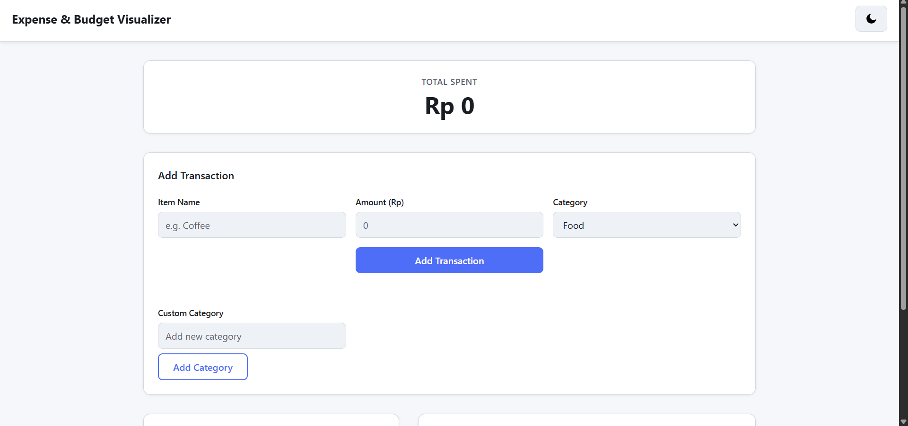

# 💸 Expense & Budget Visualizer

A mobile-friendly web application to track daily expenses, manage budget, and visualize spending habits. Built using **Vanilla JavaScript**, this app focuses on simplicity, performance, and usability—perfect for quick personal finance tracking.

---

## 🚀 Live Demo

👉 https://ilhamriz.github.io/CodingCamp-30Mar26-milhamrizky/

---

## 📸 Preview

<!-- Add your screenshot here -->



---

## ✨ Features

### 🧾 Transaction Management

- Add new expenses with:
  - Item name
  - Amount
  - Category (Food, Transport, Fun)

- Input validation to ensure all fields are filled
- Delete transactions easily

### 📋 Transaction List

- Scrollable list of all transactions
- Displays:
  - Name
  - Amount
  - Category

### 💰 Total Balance

- Automatically calculated total spending
- Updates instantly when transactions change

### 📊 Visual Chart

- Pie chart showing spending distribution by category
- Dynamic updates using Chart.js

---

## 🧠 Tech Stack

- **HTML** – Structure
- **CSS** – Styling (single file)
- **Vanilla JavaScript** – Logic (single file)
- **Chart.js** – Data visualization
- **Local Storage API** – Client-side data persistence

---

## 📁 Project Structure

```
project-root/
│
├── index.html
├── css/
│   └── styles.css
├── js/
│   └── app.js
└── README.md
```

---

## 💾 Data Storage

All data is stored locally in the browser using **Local Storage**:

- No backend required
- Data persists even after page refresh
- Fully client-side application

---

## 📱 Responsive Design

- Mobile-first approach
- Works smoothly on:
  - 📱 Smartphones
  - 💻 Desktop browsers

---

## ⚡ Performance

- Fast load time
- Smooth UI updates
- No external dependencies except Chart.js

---

## 🌙 Challenge Features (Optional Enhancements)

- [ ] Add custom categories
- [ ] Monthly summary view
- [ ] Sort transactions (by amount/category)
- [ ] Dark / Light mode toggle

---

## 🛠️ Installation & Usage

1. Clone the repository:

```bash
git clone https://github.com/ilhamriz/CodingCamp-30Mar26-milhamrizky.git
```

2. Open `index.html` in your browser

No build tools, no setup required 🚀

---

## 🌐 Deployment

This project is deployed using **GitHub Pages**:

1. Go to your repository
2. Open **Settings > Pages**
3. Select branch: `master`
4. Save and get your live URL

---

## 🎯 Goals of This Project

- Practice DOM manipulation using Vanilla JS
- Implement real-time UI updates
- Work with browser Local Storage
- Build clean and responsive UI without frameworks
- Create a portfolio-ready project

---

## 👤 Author

**Muhammad Ilham Rizky**

- GitHub: https://github.com/ilhamriz
